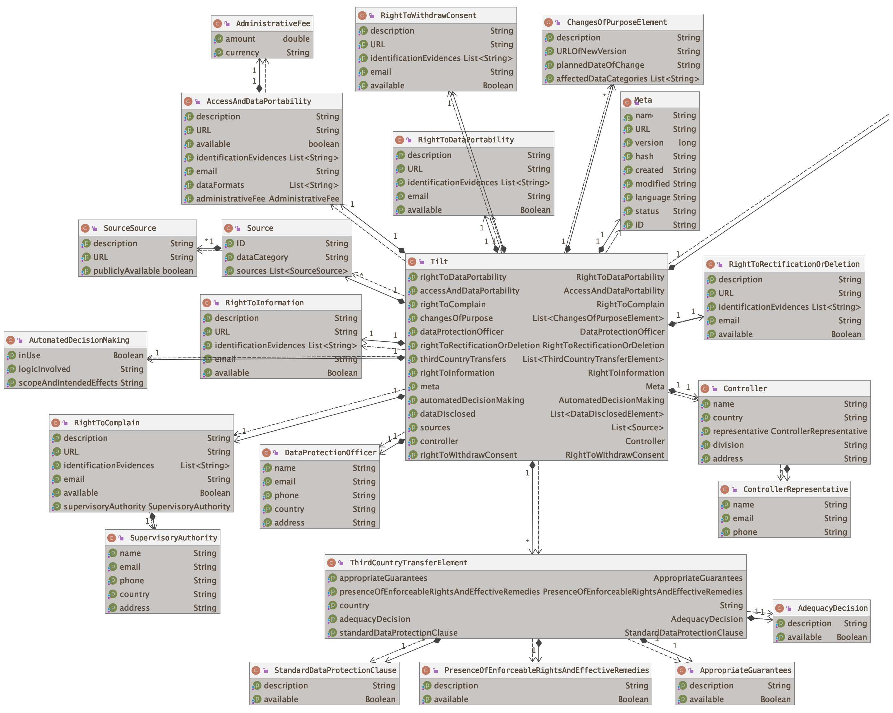
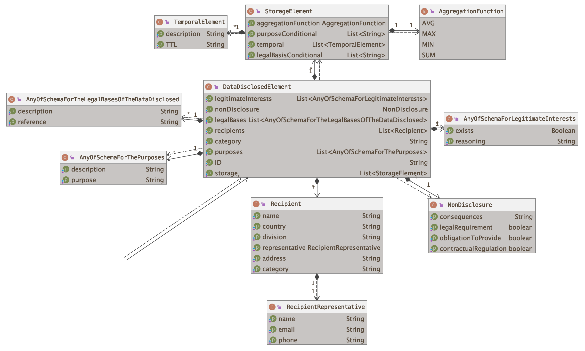

# Transparency Information Language and Toolkit
With this proposed schema for transparency information with regards to data privacy, an essential step towards a sophisticated ecosystem shall be made by introducing a transparency enhancing toolkit based on a formal language model describing transparency information in the context of multi-service environments and latest legal requirements (EU General Data Protection Regulation). The desired results of the work should be suitable as ready-to-use privacy engineering solutions for developers and serve as a starting point for further research in this area. Eventually, data subjects should (be able to) understand what happens to data relating to them by using the interfaces of the toolkit.

## Language definition
**[For the main language definition incl. an exemplary document, please see here. ⤴️](tilt-schema.json)** 
The [valid](tilt.json) exemplary document standalone. 
An [*in*valid](tilt-NOT-valid.json) exemplary document standalone.

## Documentation
**[For a full documentation, please see here. ⤴️](https://transparency-information-language.github.io/schema/index.html)** 
[A Markdown version is available here. ⤴️](documentation/markdown/tilt-schema.md)

## Author
[Elias Grünewald](mailto:gruenewald@tu-berlin.de)

## License
[MIT License](LICENSE)
